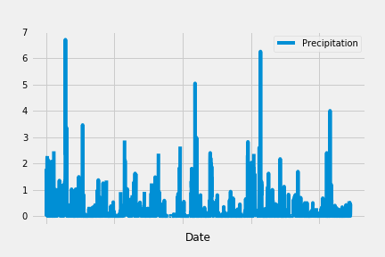
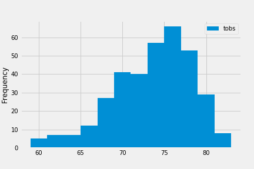
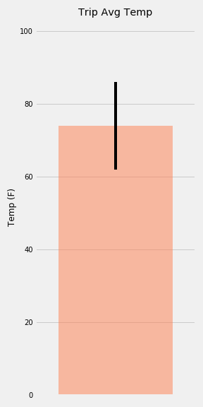
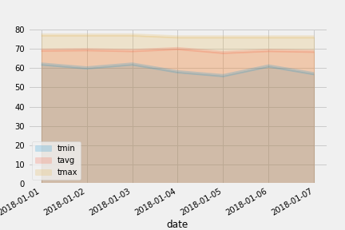

# Climate Analysis and Exploration
## Step 1 
To begin, use Python and SQLAlchemy to do basic climate analysis and data exploration of your climate database using SQLAlchemy ORM queries, Pandas, and Matplotlib.

- Use SQLAlchemy `create_engine` to connect to your sqlite database.

- Use SQLAlchemy `automap_base()` to reflect your tables into classes and saved a reference to those classes called `Station` and `Measurement`.

## Precipitation Analysis

- Design a query to retrieve the last 12 months of precipitation data.

- Select only the `date` and `prcp` values.

- Load the query results into a Pandas DataFrame and set the index to the date column.

- Sort the DataFrame values by `date`.

- Plot the results using the DataFrame `plot` method.

- Use Pandas to print the summary statistics for the precipitation data.

## Station Analysis

- Designed a query to calculate the total number of stations.

- Designed a query to find the most active stations.

- Listed the stations and observation counts in descending order.

- Designed a query to retrieve the last 12 months of temperature observation data (tobs).

- Filter by the station with the highest number of observations.

- Plot the results as a histogram with `bins=12`.

## Step 2 - Climate App
- Designed a Flask API based on the developed queries.

Use FLASK to create your routes.

## Routes

- `/`

* Home page.

* Listed all routes that are available.

- `/api/v1.0/precipitation`

* Converted the query results to a Dictionary using date as the key and prcp as the value.

* Returned the JSON representation of your dictionary.

- `/api/v1.0/stations`

* Returned a JSON list of stations from the dataset.

- `/api/v1.0/tobs`

query for the dates and temperature observations from a year from the last data point.
Return a JSON list of Temperature Observations (tobs) for the previous year.

- `/api/v1.0/<start> and /api/v1.0/<start>/<end>`

* Returned a JSON list of the minimum temperature, the average temperature, and the max temperature for a given start or start-end range.

* When given the start only, calculate TMIN, TAVG, and TMAX for all dates greater than and equal to the start date.

* When given the start and the end date, calculate the TMIN, TAVG, and TMAX for dates between the start and end date inclusive.

## Temperature Analysis I

- Identified the average temperature in June at all stations across all available years in the dataset. Did the same for December temperature.

- Used the t-test to determine whether the difference in the means, if any, is statistically significant.

## Temperature Analysis II

- Used the `calc_temps` function to calculate the min, avg, and max temperatures for your trip using the matching dates from the previous year (i.e., use "2017-01-01" if your trip start date was "2018-01-01").

- Plotted the min, avg, and max temperature from your previous query as a bar chart.

- Used the average temperature as the bar height.

- Used the peak-to-peak (tmax-tmin) value as the y error bar (yerr).

# Daily Rainfall Average

- Calculated the rainfall per weather station using the previous year's matching dates.

- Calculated the daily normals. Normals are the averages for the min, avg, and max temperatures.

- Created a list of dates for your trip in the format `%m-%d`. Use the `daily_normals` function to calculate the normals for each date string and append the results to a list.

- Loaded the list of daily normals into a Pandas DataFrame and set the index equal to the date.

- Used Pandas to plot an area plot (`stacked=False`) for the daily normals.

